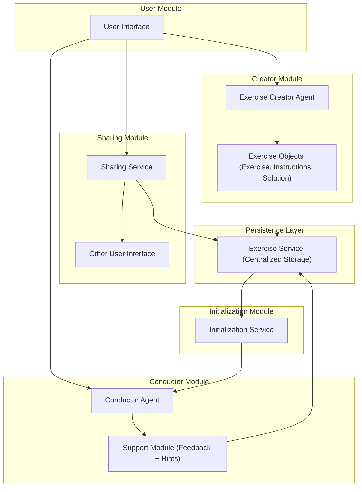

# Exerciser

This exerciser is an agent integrated in the THEIA-IDE, which can be used to do programming exercises

---
## System design

```mermaid
flowchart TD
 subgraph UserModule["User Module"]
        UI["User Interface"]
      end
 subgraph CreatorModule["Creator Module"]
        Creator["Exercise Creator Agent"]
        ExerciseObj["Exercise Objects (Exercise, Instructions, Solution)"]
  end
 subgraph ConductorModule["Conductor Module"]
        Conductor["Conductor Agent"]
        Support["Support Module (Feedback + Hints)"]
  end
 subgraph SharingModule["Sharing Module"]
        Sharing["Sharing Service"]
        OtherUser["Other User Interface"]
  end
 subgraph PersistenceLayer["Persistence Layer"]
        ExerciseService["Exercise Service (Centralized Storage)"]
  end
 subgraph InitService["Initialization Module"]
        Initialization["Initialization Service"]
  end
    UI --> Creator & Conductor & Sharing
    Creator --> ExerciseObj
    ExerciseObj --> ExerciseService
    ExerciseService --> Initialization
    Initialization --> Conductor
    Conductor --> Support
    Support --> ExerciseService
    Sharing --> ExerciseService & OtherUser

```

