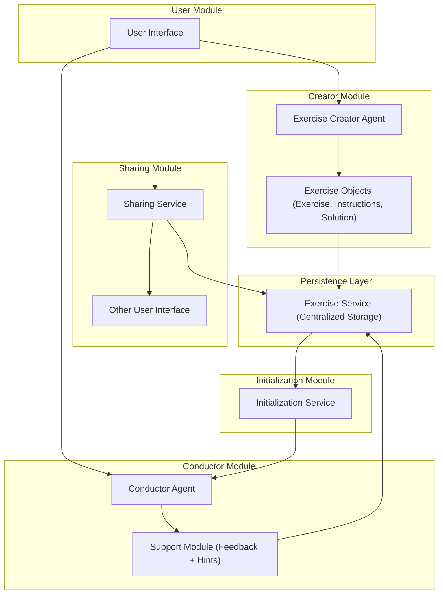

# Exerciser

This exerciser is an agent integrated in the THEIA-IDE, which can be used to do programming exercises

---
## System design

## Requirement

**1. Purpose**

The goal of the project is to create an AI agent for a web-based IDE that can design programming exercises and guides the user (student) through these exercises.

**2. User Requirements**

2.1. Exercise Creation
2.1.1. User Story
- #5 

2.1.2. Acceptance Criteria:

2.2. Exercise Sharing
2.2.1. User Story
- #7 

2.2.2. Acceptance Criteria:

2.3. Exercise Instantiation
2.3.1. User Story
- #8

2.3.2. Acceptance Criteria:

2.4. Exercise Conduction
2.4.1. User Story
- #9 

2.4.2. Acceptance Criteria:

2.5. Workspace Security
2.5.1. User Story
- #23

2.5.2. Acceptance Criteria:

2.6. Simplified Usage
2.6.1. User Story
- #24

2.6.2. Acceptance Criteria:

2.7. Existence Platform Leverage
2.7.1. User Story
- #25

2.7.2. Acceptance Criteria:

**3. Non-Functional Requirements**

**4. Appendix**
- Architecture and System Design  #14
